# Dashboard Boilerplate

설정 없이도 바로 데모를 확인할 수 있고, Upstash Redis와 Google 로그인을 연결하면 데이터를 직접 편집할 수 있는 대시보드입니다.

---

## 📑 목차

- [시작 전 확인](#시작-전-확인)
- [처음 시작하는 분께](#처음-시작하는-분께)
- [직접 실행하는 방법](#직접-실행하는-방법)
- [데이터 저장소 연결하기](#데이터-저장소-연결하기)
- [인터넷에 배포하기](#인터넷에-배포하기)
- [Google 로그인 설정하기](#google-로그인-설정하기)
- [서비스 이름과 문구 바꾸기](#서비스-이름과-문구-바꾸기)
- [문제가 생겼을 때](#문제가-생겼을-때)
- [참고 문서](#참고-문서)

---

## 시작 전 확인

이 프로젝트는 **VS Code + Claude Code** 환경에서 작업합니다.
아직 환경이 세팅되어 있지 않다면 아래 문서를 먼저 참고하세요.

→ [VS Code + Claude Code 세팅 가이드](https://iotrust.atlassian.net/wiki/spaces/pnc/pages/202375218/VS+Code+Claude)

---

## 처음 시작하는 분께

이 프로젝트를 처음 받으셨다면 아래 순서대로 따라오시면 됩니다.

**1단계 — 레포지토리를 받아옵니다**

코드를 내 컴퓨터로 가져옵니다. (→ [직접 실행하는 방법](#직접-실행하는-방법))

**2단계 — 데이터 저장소를 연결합니다**

화면에 보이는 숫자와 내용을 저장하는 공간이 필요합니다. 무료로 만들 수 있습니다. (→ [데이터 저장소 연결하기](#데이터-저장소-연결하기))

**3단계 — Vercel에 배포합니다**

인터넷에서 접속할 수 있도록 배포합니다. (→ [인터넷에 배포하기](#인터넷에-배포하기))

**4단계 — Google 로그인을 설정합니다**

팀원들이 Google 계정으로 로그인할 수 있도록 설정합니다. (→ [Google 로그인 설정하기](#google-로그인-설정하기))

**이후 — 대시보드를 수정합니다**

서비스 이름, 지표, 차트 등을 우리 팀에 맞게 바꿉니다. (→ [서비스 이름과 문구 바꾸기](#서비스-이름과-문구-바꾸기))

---

## 직접 실행하는 방법

컴퓨터에 Node.js와 Git이 설치되어 있어야 합니다.

터미널에서 아래를 순서대로 입력합니다.

```bash
git clone https://github.com/IotrustAX/dashboard-boilerplate.git
cd dashboard-boilerplate
npm install
cp .env.example .env.local
npm run dev
```

실행 후 브라우저에서 `http://localhost:3000`으로 접속하면 화면이 열립니다.

---

## 데이터 저장소 연결하기

편집한 내용이 저장되려면 **Upstash**라는 무료 서비스를 연결해야 합니다. 연결하지 않아도 화면은 뜨지만 기본 샘플 데이터만 보입니다.

1. [https://console.upstash.com](https://console.upstash.com)에서 무료 계정을 만듭니다.
2. **Create Database**를 눌러 데이터베이스를 하나 만듭니다.
   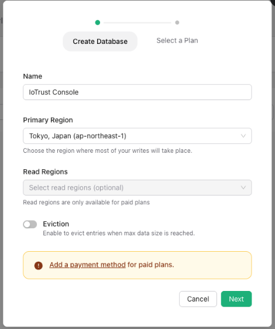
   - **Name**: 원하는 이름 입력 (예: `IoTrust Console`)
   - **Primary Region**: `Tokyo, Japan (ap-northeast-1)` 선택 — 한국에서 가장 가까운 리전입니다
   - **Read Regions**: 비워둡니다 (무료 플랜은 지원 안 됨)
   - **Eviction**: 반드시 **Off** 상태로 둡니다 — 켜면 데이터가 자동 삭제될 수 있습니다
3. **Next**를 클릭하고 다음 화면에서 **Free 플랜**을 선택합니다.
4. 만들어진 데이터베이스를 클릭하면 상세 화면이 열립니다.
5. **Connect** 탭에서 아래 두 줄을 복사합니다.
   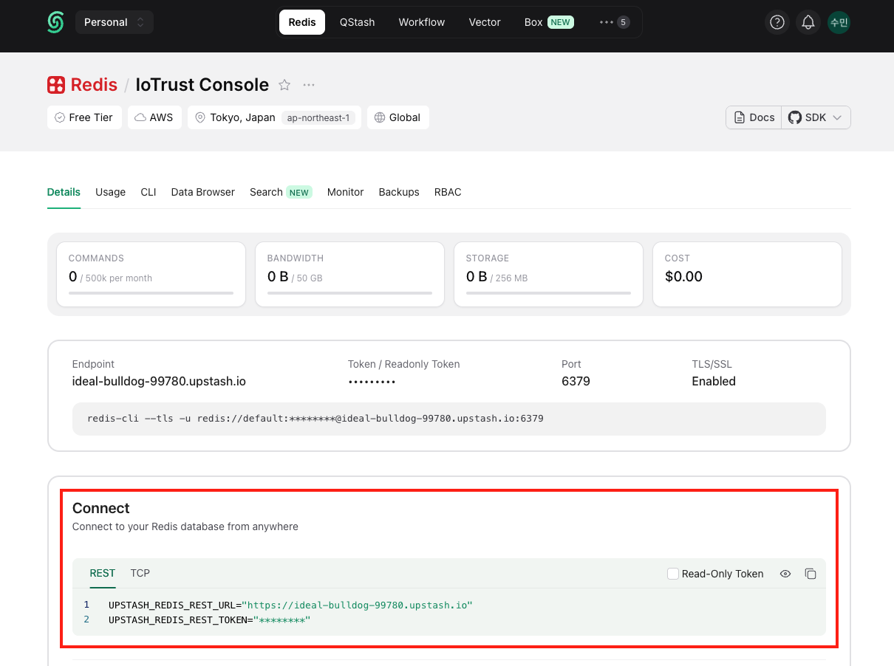
   - `UPSTASH_REDIS_REST_URL`로 시작하는 줄
   - `UPSTASH_REDIS_REST_TOKEN`로 시작하는 줄
6. 복사한 값을 프로젝트 폴더 안의 `.env.local` 파일에 붙여넣습니다.

> `.env.local` 파일이 없다면 `.env.example` 파일을 복사해서 이름을 `.env.local`로 바꿔 사용하세요.

> **다른 데이터를 연결하고 싶다면?**
> 위 항목들은 어디까지나 예시입니다. 매출이나 사용자 수 대신 본인 서비스에 맞는 지표, 차트, 표로 자유롭게 바꿀 수 있습니다. 외부 API나 데이터베이스에서 직접 가져오는 것도 가능합니다.

---

## 인터넷에 배포하기

GitHub에 코드를 push하면 Vercel에 자동으로 배포됩니다. 아래 순서대로 한 번만 세팅하면 됩니다.

### 1단계 — Vercel 프로젝트 만들기

1. [https://vercel.com](https://vercel.com)에 접속해 계정을 만들거나 로그인합니다.
2. **"Add New Project"**를 클릭합니다.
   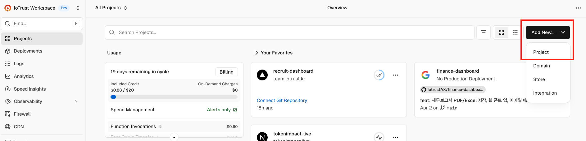
3. GitHub 저장소를 연결하고 이 프로젝트를 선택해 
**Deploy**합니다.
   - 이 때 배포는 실패해도 괜찮습니다. 환경변수가 없어서 그런 것이고, 다음 단계에서 채웁니다.
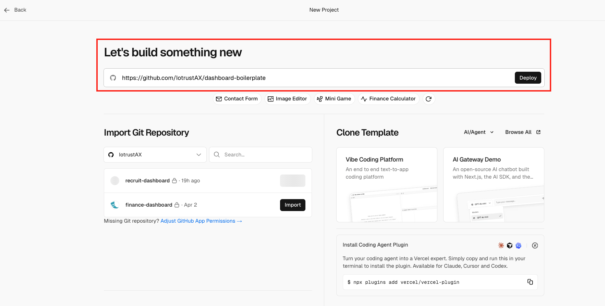
4. 생성된 프로젝트에서 왼쪽 툴바의 **Setting**에서 아래 세 값을 복사해 둡니다.

   **`VERCEL_PROJECT_ID`** — 프로젝트 페이지 → Settings → General → Project ID
      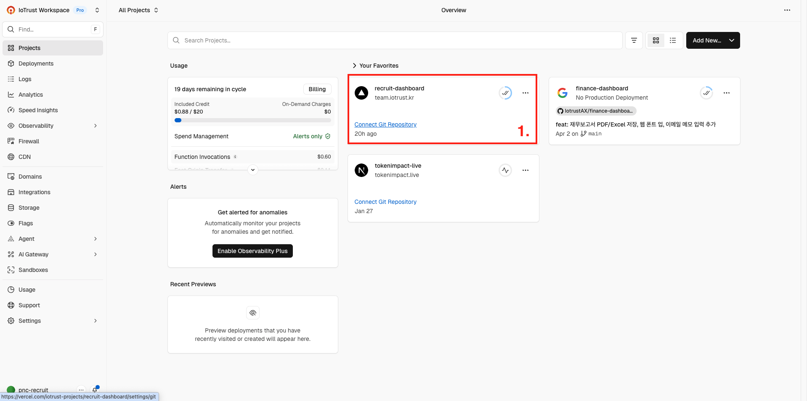 
      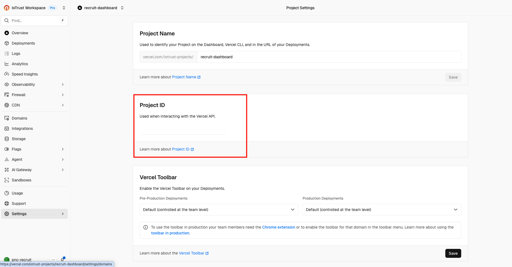 

   **`VERCEL_ORG_ID`** — 메인 페이지 -> Settings
      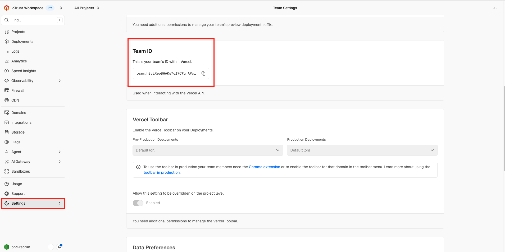 

   **`VERCEL_TOKEN`** — Vercel 계정 우측 상단 → Settings → Tokens → **"Create Token"**
      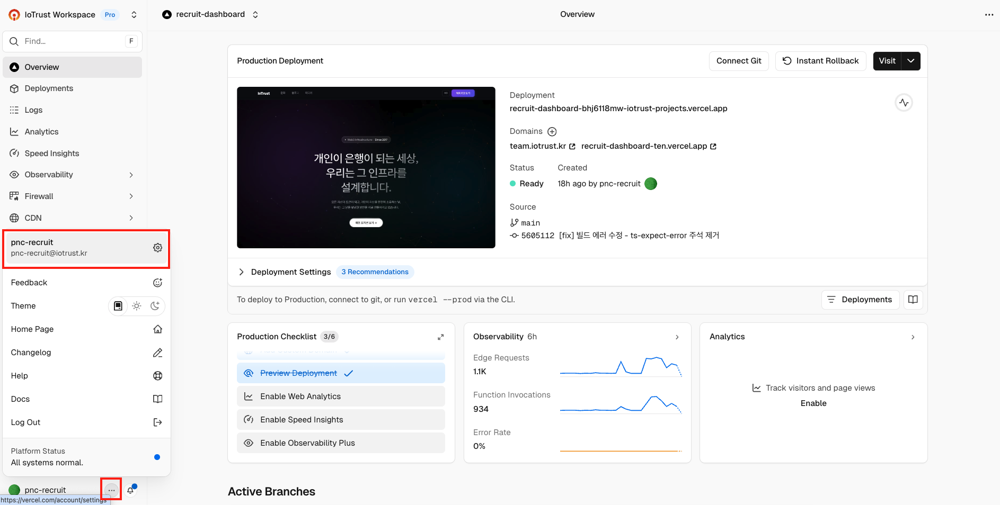
      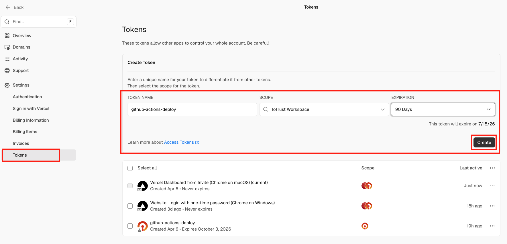
      

### 2단계 — Vercel 환경변수 등록

Vercel 프로젝트 → **Settings → Environment Variables**에 아래 값들을 등록합니다.

| 키 | 값 |
|---|---|
| `AUTH_SECRET` | `openssl rand -base64 32` 명령으로 생성한 랜덤 문자열 |
| `GOOGLE_CLIENT_ID` | Google Cloud Console에서 발급한 클라이언트 ID |
| `GOOGLE_CLIENT_SECRET` | Google Cloud Console에서 발급한 시크릿 |
| `UPSTASH_REDIS_REST_URL` | Upstash에서 복사한 URL |
| `UPSTASH_REDIS_REST_TOKEN` | Upstash에서 복사한 토큰 |
| `NEXT_PUBLIC_APP_NAME` | 앱 이름 (예: `IoTrust Console`) |
| `NEXT_PUBLIC_APP_URL` | 배포 URL (예: `https://your-project.vercel.app`) |
| `AUTH_URL` | 배포 URL (위와 동일) |
| `ALLOWED_EMAIL_DOMAIN` | `iotrust.kr` |

### 3단계 — GitHub Secrets 등록

GitHub 저장소 → **Settings → Secrets and variables → Actions**에 아래 값들을 등록합니다.
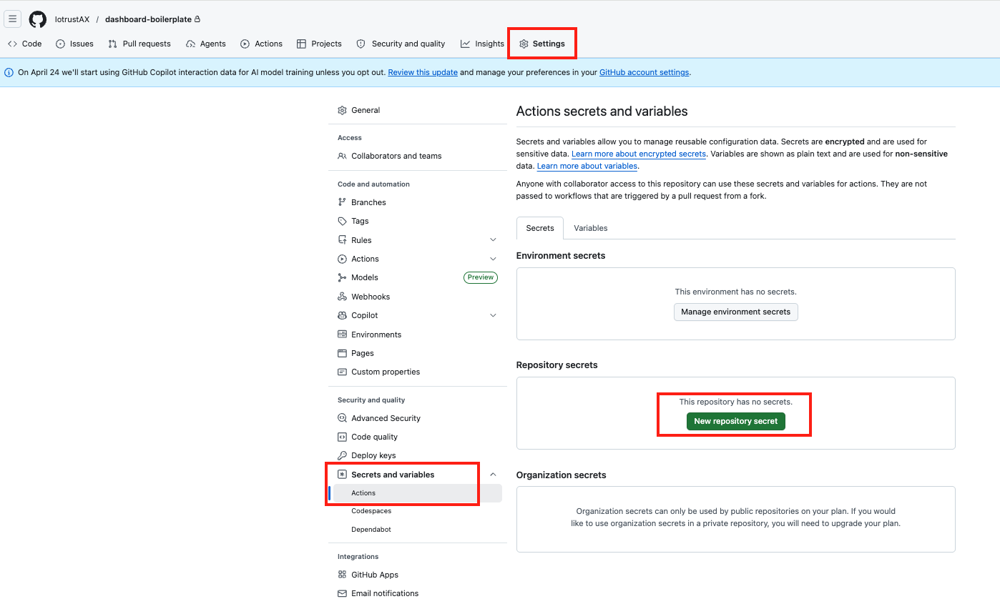
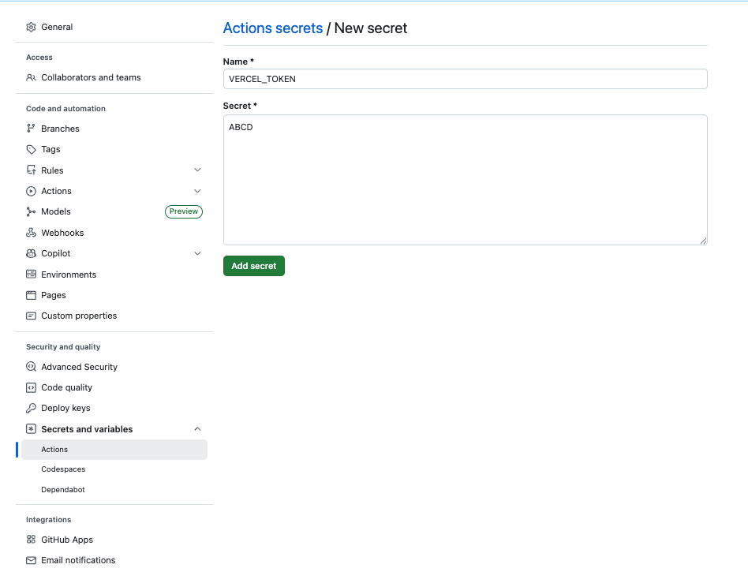

**Secrets 탭**

| 키 | 값 |
|---|---|
| `VERCEL_TOKEN` | 1단계에서 복사한 토큰 |
| `VERCEL_ORG_ID` | 1단계에서 복사한 org ID |
| `VERCEL_PROJECT_ID` | 1단계에서 복사한 프로젝트 ID |
| `AUTH_SECRET` | Vercel에 등록한 것과 동일한 값 |
| `GOOGLE_CLIENT_ID` | Vercel에 등록한 것과 동일한 값 |
| `GOOGLE_CLIENT_SECRET` | Vercel에 등록한 것과 동일한 값 |

**Variables 탭**

| 키 | 값 |
|---|---|
| `NEXT_PUBLIC_APP_NAME` | 앱 이름 |
| `NEXT_PUBLIC_APP_URL` | 배포 URL |
| `AUTH_URL` | 배포 URL |
| `ALLOWED_EMAIL_DOMAIN` | `iotrust.kr` |

### 4단계 — 배포 확인

main 브랜치에 코드를 push하면 GitHub Actions가 자동으로 실행되어 Vercel에 배포됩니다. GitHub 저장소의 **Actions** 탭에서 진행 상황을 확인할 수 있습니다.

---

## Google 로그인 설정하기

처음에는 로그인 설정 없이 데모 화면을 먼저 볼 수 있습니다. 실제 운영 전에 아래를 설정합니다.

### 필요한 것

Google Cloud Console에서 아래 4개 값을 발급받아야 합니다.

| 항목 | 설명 |
|------|------|
| `GOOGLE_CLIENT_ID` | Google이 이 앱을 알아보기 위한 식별자입니다 |
| `GOOGLE_CLIENT_SECRET` | Google이 이 앱을 신뢰하기 위한 비밀 열쇠입니다 |
| `AUTH_SECRET` | 로그인 정보를 안전하게 암호화하는 임의의 긴 문자열입니다 |
| `AUTH_URL` | 이 사이트가 열리는 주소입니다 (예: `https://your-project.vercel.app`) |

### 1단계 — Google Cloud Console 접속 및 약관 동의

1. [https://console.cloud.google.com](https://console.cloud.google.com)에 회사 Google 계정으로 접속합니다.
2. **"My First Project"** 가 자동으로 만들어져 있다면 그것을 사용하거나, 사진처럼 새 프로젝트를 생성해야 합니다.
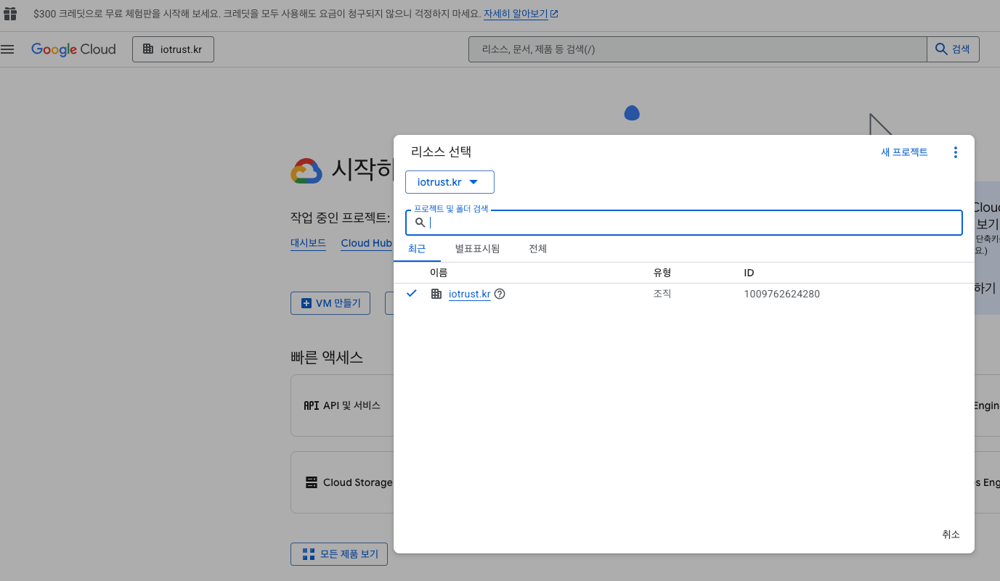
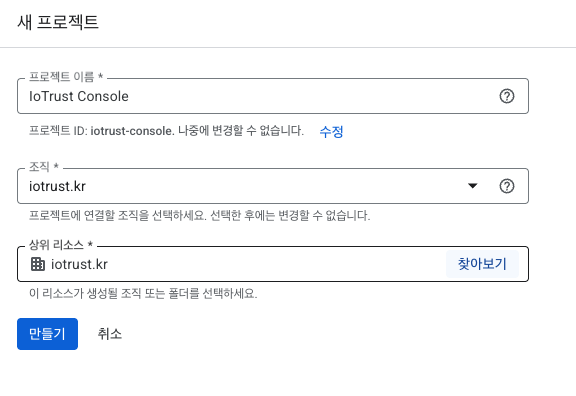

### 2단계 — OAuth 동의 화면 설정

1. 아래의 **API 및 서비스 → OAuth 동의 화면**으로 이동합니다.
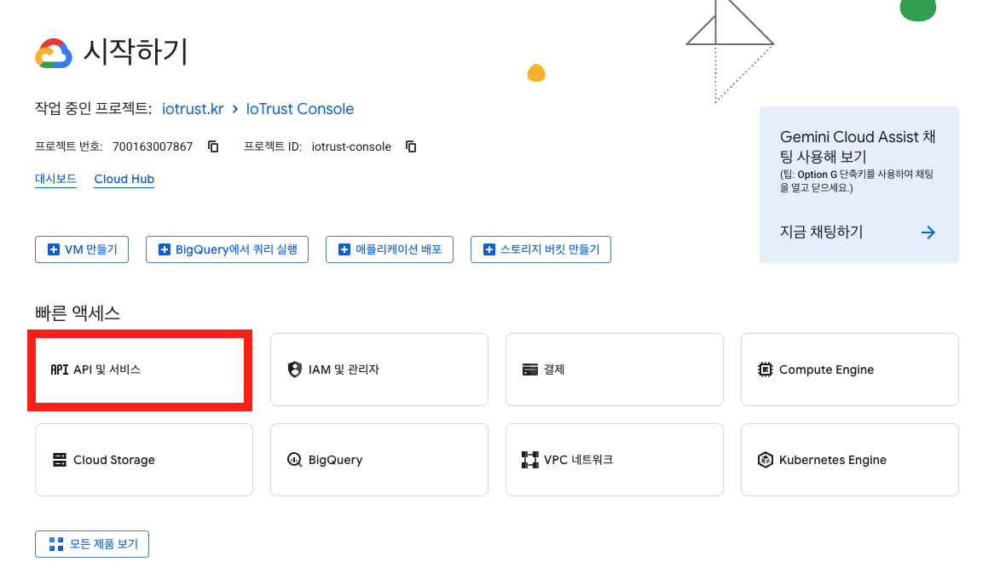
2. User Type은 **내부(Internal)**를 선택하고 **만들기**를 클릭합니다.
   - IoTrust Google Workspace 계정으로 접속했을 때만 이 옵션이 활성화됩니다.
   - 내부로 설정하면 조직 외부 사람은 로그인 자체가 차단됩니다.
3. 앱 이름, 사용자 지원 이메일, 개발자 연락처 이메일을 입력하고 저장합니다.

### 3단계 — OAuth 클라이언트 ID 발급

1. 왼쪽 메뉴에서 **API 및 서비스 → 사용자 인증 정보**로 이동합니다.
2. 아래의 사진을 따라 브랜딩을 생성합니다.
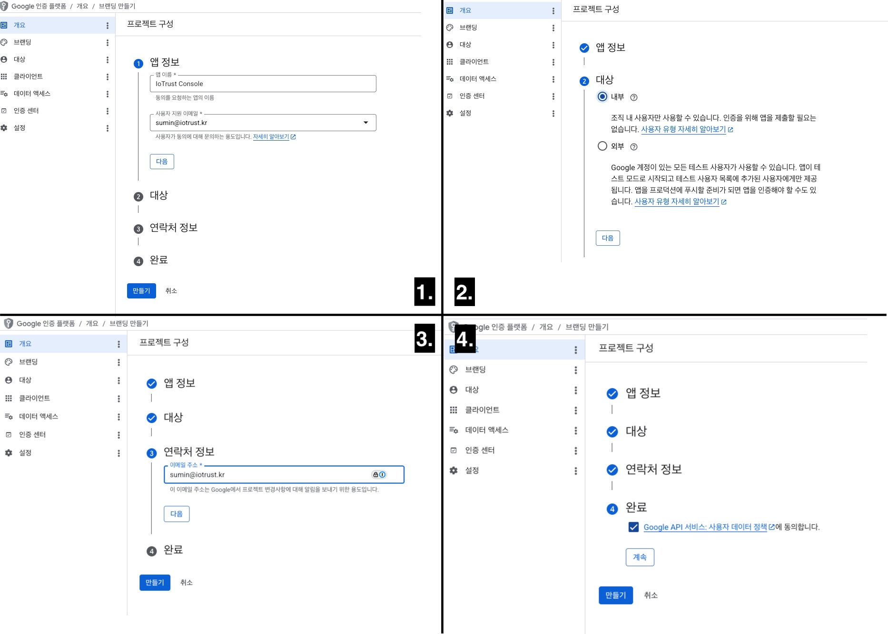
3. **"+ 사용자 인증 정보 만들기" → "OAuth 클라이언트 ID"**를 클릭합니다.
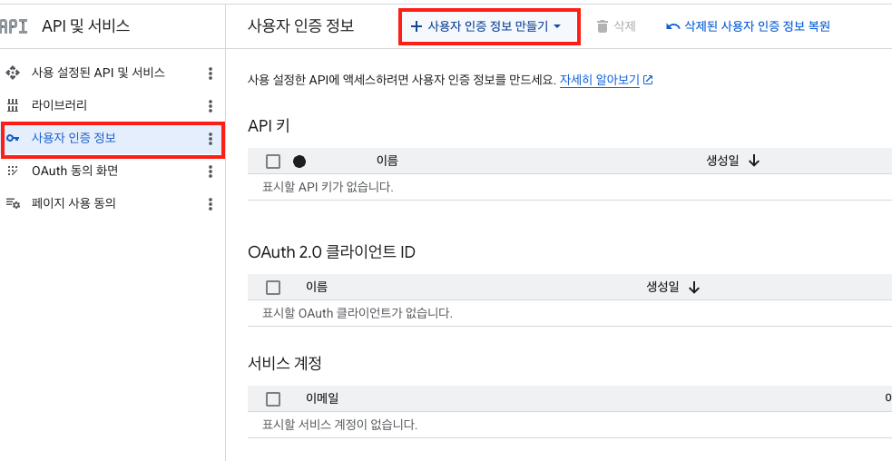
4. 애플리케이션 유형: **웹 애플리케이션** -> **이름** 기본값으로 유지
5. 아래 주소를 등록합니다.

   **승인된 JavaScript 원본**
   ```
   https://your-project.vercel.app
   http://localhost:3000
   ```

   **승인된 리디렉션 URI**
   ```
   https://your-project.vercel.app/api/auth/callback/google
   http://localhost:3000/api/auth/callback/google
   ```

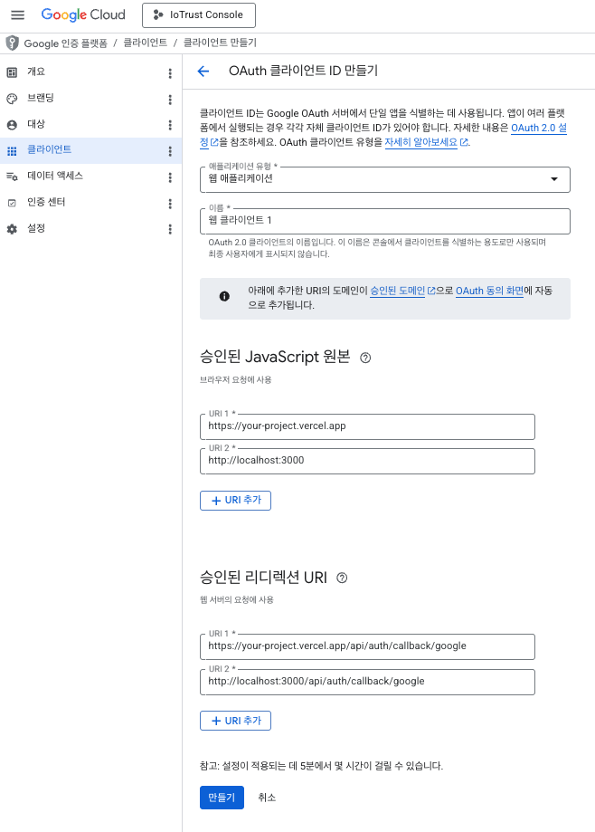

5. **만들기**를 클릭하면 **클라이언트 ID**와 **클라이언트 보안 비밀번호**가 표시됩니다. 이 두 값을 복사해 `.env.local`에 붙여넣습니다.

### `.env.local` 작성 예시

```
NEXT_PUBLIC_APP_NAME="우리 팀 대시보드"
NEXT_PUBLIC_APP_URL="https://your-project.vercel.app"
AUTH_URL="https://your-project.vercel.app"
AUTH_SECRET="랜덤하고_긴_문자열을_여기에"
GOOGLE_CLIENT_ID="구글에서_발급받은_클라이언트_ID"
GOOGLE_CLIENT_SECRET="구글에서_발급받은_시크릿"
UPSTASH_REDIS_REST_URL="https://upstash에서_복사한_URL"
UPSTASH_REDIS_REST_TOKEN="upstash에서_복사한_토큰"
ALLOWED_EMAIL_DOMAIN="iotrust.kr"
```

---

## 서비스 이름과 문구 바꾸기

화면에 보이는 서비스 이름, 소개 문구, 메뉴 이름은 `src/config/site.config.ts` 파일에서 바꿉니다.

개발자에게 수정을 요청하거나, 파일을 직접 열어서 텍스트 부분만 수정하면 됩니다.

---

## 문제가 생겼을 때

**로그인 버튼이 작동하지 않아요**
→ `.env.local`에 `GOOGLE_CLIENT_ID`, `GOOGLE_CLIENT_SECRET`, `AUTH_SECRET`이 채워져 있는지 확인하세요.

**로그인 후 오류 화면이 나와요**
→ `AUTH_URL` 값이 실제 접속 주소와 일치하는지, Google Console의 리디렉션 URI가 맞게 등록되어 있는지 확인하세요.

**Edit Data에서 저장이 안 돼요**
→ `.env.local`에 `UPSTASH_REDIS_REST_URL`과 `UPSTASH_REDIS_REST_TOKEN`이 올바르게 입력되어 있는지 확인하세요.

**저장했는데 화면에 반영이 안 돼요**
→ 개발 중(`npm run dev`)에는 저장 즉시 반영됩니다. 배포된 사이트에서는 페이지를 새로고침하거나 재배포가 필요할 수 있습니다.

---

## 참고 문서

- 배포 구조: [DEPLOYMENT.md](DEPLOYMENT.md)
- 환경변수 전체 목록: [`.env.example`](.env.example)
